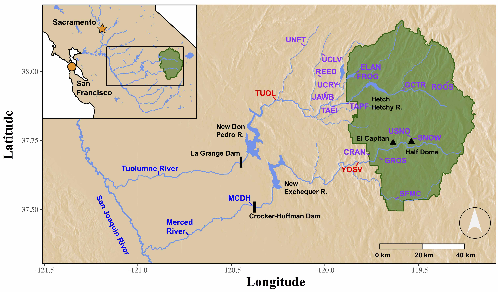

## AquaMaps
Utlizing the basic map data from last week we are going to plot some Bothidae species richness data. We are going to start with Aquamaps.

https://www.aquamaps.org/

These folks have put together a species diversity map for Bothidae. You should read up on this to see what pitfalls it may have... Maybe our local expert (TODD) will notice something.  It is located in the /2-AquaMapsPlot/ directory as "bothidae.csv" but I think if you can find and download it from AquaMaps that would be better.

## Recap From Last Week
Using what we covered last week, can you get a world map and read in the file as an object called data?

* Load the packages
* Create a "world" data frame
* Read in a file with read.csv. Hint: I used the option "skip"
```{r, message=F, warning=F, echo=FALSE}
library(tidyverse)
library(maps)
library(mapdata)
library(knitr)

world<-map_data("world")
data<-read.csv("bothidae.csv", sep=",", header=TRUE,skip=7)

```

```{r, echo=FALSE}
ggplot(world)+geom_polygon(aes(x=long, y=lat, group=group))+
  coord_fixed(1.3)
```

```{r}
head(data)
```

## What Does the AquaMaps Data Look Like?
These data are species richness in a 1/2 x 1/2 degree square. This is a "raster." Raster's are super handy!!!!

They are often used for elevation, each square contains an elevation, this is a "Digital Elevation Map." Here is one I made with R for a publication (https://doi.org/10.1002/fsh.10136).


## Handling Rasters
ggplot2 has a built in way of dealing with rasters!
```{r}
help(geom_raster)
```

Maybe we can just our data object to geom_raster? You'll need to give x, y, and a fill aesthetic.

```{r}
ggplot()+geom_raster(data=data, aes(x=Center.Longitude, y=Center.Latitude, fill=Species.Count))+
  coord_fixed(1.3)
```

Hey! That looks pretty good!!

### Raster Gradient
I don't think the black - blue gradient is that great. With ggplot, you have to be careful if something is dicrete or continuous. 

We can apply "scale_fill_gradient" and "scale_fill_gradient2" withing ggplot. You should search these in the help. Basically you can specify gradients with two colors low-> high with one and three colors low->mid->high with the other. Still, the behavior isn't always what I'd think. Here's and example.

```{r}
ggplot()+geom_raster(data=data, aes(x=Center.Longitude, y=Center.Latitude, fill=Species.Count))+
  coord_fixed(1.3)+
  scale_fill_gradient2(low="white", mid="yellow", high="red")
```

## Indo-West Pacific Focus
These plots are centered at 0,0. We probably want to focus the map around 140 degrees Longitude. To get a world map centered here I use a trick of sorts and scale_x_continuous(limits = c(-20, 340))....

Basically, we have to double our data. Here are the ranges of the world map in Longitude and Latitude.

```{r}
summary(world[1:2])
```

For the world map, you can do this.

```{r}
#Create to identical objects from world
w1 <- world
w2 <- world
# Make one go 360 degrees longer
w2$long <- w2$long + 360
# Extend the groups so that they are not redundant
w2$group <- w2$group + max(w2$group) + 1
#Combine them
newWorld <- rbind(w1, w2)

#Plot
ggplot(newWorld)+geom_polygon(aes(x=long, y=lat, group=group))+
  coord_fixed(1.3)
```

Now we can recenter the world map!

```{r}
map<-ggplot(newWorld)+geom_polygon(aes(x=long, y=lat, group=group))+
  coord_fixed(1.3)+
  scale_x_continuous(limits = c(-20, 340))

map
```

Hmm... I don't like how Antartica turned out, but I haven't found a way around this one yet.

### With the Raster

```{r}
raster1<-data
raster2<-data
raster2$Center.Longitude <- raster2$Center.Longitude + 360
raster<-rbind(raster1, raster2)

ggplot()+geom_raster(data=raster, aes(x=Center.Longitude, y=Center.Latitude, fill=Species.Count))+
  scale_fill_gradient2(low="white", mid="yellow", high="red")+
  coord_fixed(1.3)
```

## All Together

```{r}

ggplot(newWorld)+geom_polygon(aes(x=long, y=lat, group=group))+
  geom_raster(data=raster, aes(x=Center.Longitude, y=Center.Latitude, fill=Species.Count))+
  scale_fill_gradient2(low="white", mid="yellow", high="red")+
  coord_fixed(1.3)+
  scale_x_continuous(limits = c(-20, 340))

```

```{r}

map<-ggplot(newWorld)+geom_polygon(aes(x=long, y=lat, group=group), fill="grey50", color="grey50")+
  geom_raster(data=raster, aes(x=Center.Longitude, y=Center.Latitude, fill=Species.Count))+
  scale_fill_gradient2(low="white", mid="yellow", high="red", name="Species Count")+
  coord_fixed(1.3)+
  scale_x_continuous(limits = c(-20, 340))+
  theme_bw()+
  theme(panel.grid.major = element_blank(), 
        panel.grid.minor = element_blank(),
        panel.background = element_rect(fill="lightblue2"))+
  xlab("Longitude")+
  ylab("Latitude")
  

map

```


How would you make this prettier?


In the end, you can save to a file.

```{r}

pdf("map.pdf", width=11, height=8.5)
map
dev.off()
```
